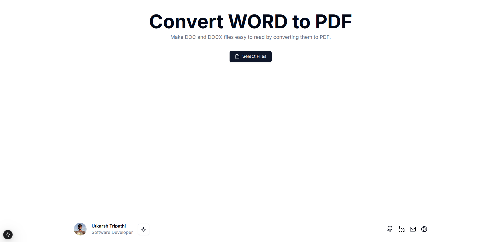
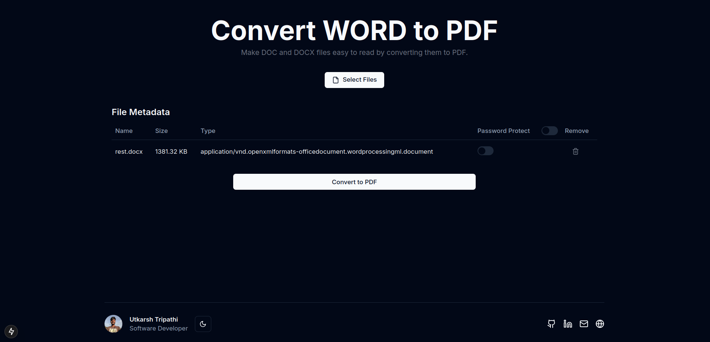

## Platform

This is the frontend service which is responsible for the UI of the application.
It provides the user with the ability to upload the doc files and download the pdf files and also to optionally password protect the pdf files.

## Screenshots

## Running the frontend

- `npm install` to install the dependencies
- `npm run dev` to run the server
- `npm run build` to build the frontend

## Technologies Used

- Nextjs
- Tailwind CSS
- Typescript
